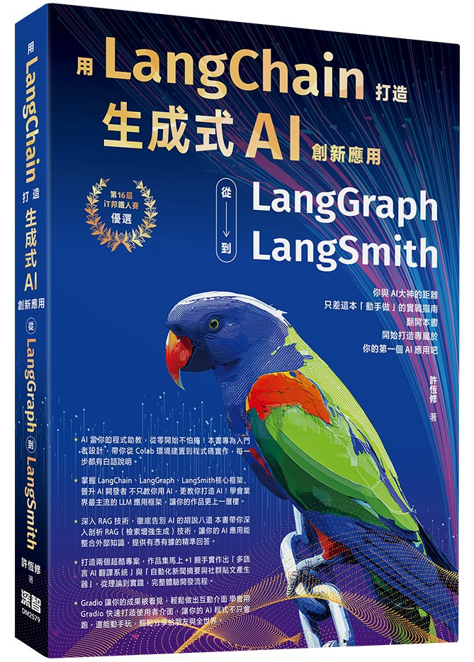

# 用 LangChain 打造生成式 AI 創新應用：從 LangGraph 到 LangSmith
<a href="https://www.tenlong.com.tw/products/9786267757420?list_name=r-zh_tw"></a>

此儲存庫為 LangChain 打造生成式 AI 創新應用：從 LangGraph 到 LangSmith》的搭配程式範例。上方圖片 `DM2579.png` 為書籍封面，已放在專案根目錄，可直接在 README 中顯示。

## 購書管道（點擊前往）

- [天瓏書局（實體書現貨購買）](https://www.tenlong.com.tw/products/9786267757420?list_name=r-zh_tw)
- [博客來（實體書現貨購買）](https://www.books.com.tw/products/0011034639)
- [讀冊生活（TAAZE）（實體書現貨購買）](https://www.taaze.tw/usedList.html?oid=11101075533&srsltid=AfmBOop1EHDSSTnQjW5c3KGEj8ypmPekY_3upR8dNBqgLj3fmECWs06a)
- [MoMo（實體書現貨購買）](https://www.momoshop.com.tw/goods/GoodsDetail.jsp?i_code=14531088&srsltid=AfmBOoo7iDii1A--AG8-_KIGMJwDaPkfKQxAFbpyYtb5ODD622voqa95)
- [三民網路書店](https://www.sanmin.com.tw/product/index/014909299)
- [Kobo 樂天（電子書醞釀中）]()
- [Readmoo（讀墨，電子書醞釀中）]()
- [Pubu（電子書醞釀中）]()
- [Google Play 圖書（電子書醞釀中）]()
- [HyRead（凌網，電子書醞釀中）]()
- [UDN 讀書吧（電子書醞釀中）]()

## 專案目錄
---------------------

- `chXX/` — Jupyter notebooks（主要範例與文字說明）

## 使用指南

1. 克隆此 repository:
   ```
   git clone https://github.com/Heng-xiu/

2. 瀏覽 `notebooks/chXX/` 目錄以查看每章程式碼，配合書中說明進行

## Star 趨勢

[](https://star-history.com/#Heng-xiu/langchain-langgraph-langsmith-book&Date)

## 提問、回饋與貢獻此資料庫

我非常歡迎各種形式的回饋，最適合透過 [GitHub Discussions](https://github.com/Heng-xiu/langchain-langgraph-langsmith-book/discussions) 分享。 同樣地，如果您有任何問題，或只是想與其他人交流想法，也請不要猶豫在論壇中提出。

請注意，由於此資料庫包含與實體書對應的程式碼，目前無法接受會擴充主要章節程式碼內容的貢獻，因為這會導致與實體書出現差異。保持一致性有助於確保所有讀者都能獲得流暢的使用體驗。

 
## 引用

如果您覺得本書或程式碼對您的研究有所幫助，請考慮引用它。

Chicago 格式引用：

> Sheu, Heng-Shiou. *用LangChain打造生成式AI創新應用：從 LangGraph到LangSmith*. 深智數位, 2025. ISBN: 9786267757420.

BibTeX 格式引用：

```
@book{LangGraph-Practical-Guide-to-Developing-AI-Agent,
  author       = {Heng-Shiou Sheu},
  title        = {用LangChain打造生成式AI創新應用：從 LangGraph到LangSmith},
  publisher    = {deepwisdom},
  year         = {2025},
  isbn         = {9786267757420},
  url          = {https://deepwisdom.com.tw/product/%E7%94%A8langchain%E6%89%93%E9%80%A0%E7%94%9F%E6%88%90%E5%BC%8Fai%E5%89%B5%E6%96%B0%E6%87%89%E7%94%A8%EF%BC%9A%E5%BE%9E-langgraph%E5%88%B0langsmith-dm2579/},
  github       = {https://github.com/Heng-xiu/langchain-langgraph-langsmith-book}
}
```